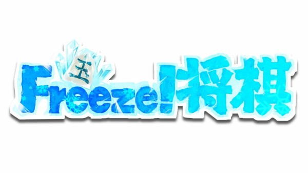
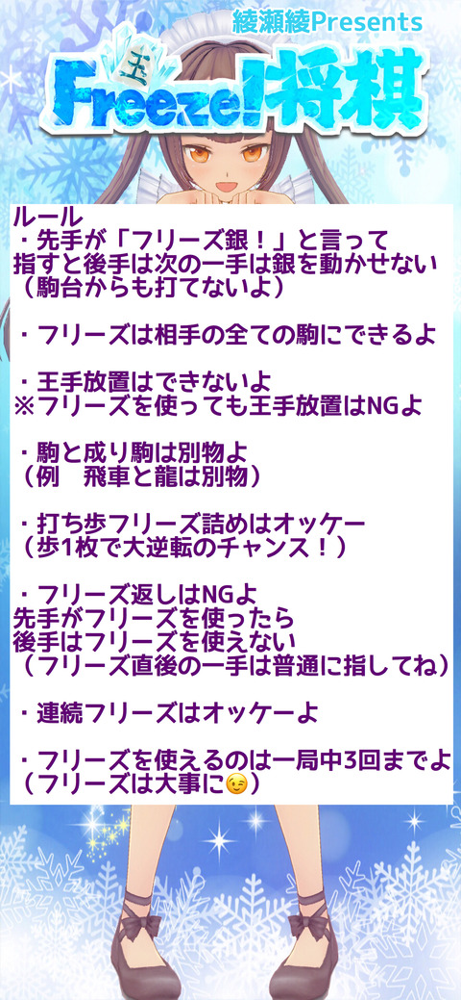

# Freeze将棋

お将棋お姉さんVtuber綾瀬綾様 考案の将棋においてのローカルルール。
不定期ながら綾瀬綾様 主催のYoutube上の実況にて日々熱い対戦が繰り広げられている。
昨今では、第2期頂上決戦(氷王)も開催された

ルール上短期決戦が多く、ある程度の定跡はあるが決定打は今の所存在しない。
(150手を超える棋譜も存在する)

基本ルール

 [本家より引用](http://freeze.blog.jp)

 

1. 先手が「フリーズ銀！」と言って指すと後手は次の一手は銀を動かせない(駒台からも動かせないよ)
1. フリーズは相手の全ての駒にできるよ
1. 王手放置はできないよ※フリーズ使っても王手放置はNGよ
1. 駒と成駒は別物よ(例 飛車と龍は別もの)
1. 打ち歩フリーズ詰めはOKよ(歩一枚で大逆転のチャンス！)
1. フリーズ返しはNGよ
	1. 先手がフリーズ使ったら後手はフリーズ使えない
	1. フリーズ直後の一手は普通に指してね
1. 連続フリーズはOKよ
1. フリーズを使えるのは一局3回までよ(フリーズは大事に)

---
## 名称
以前に、Twitterで名前を募集した時に、

> 「フリーザ様」でよくね

で、閉まってしまいましたので、当分は「フリーザ様(FREEZA)」とします。変えるかもですが;^^。
所々に「hyouOu」あるけど、気にしない;^^

---
## ソースコード

Freeze将棋には、どうしてもGUI の支援が必要で><
GUIのソースコードも公開頂いているやねうらおう様からから派生致します。

一区切りの段階で公開致しますが、ココの中身は当分は空です

[]探索部のソースコードの場所のプレースホルダ
[]表示部のソースコードの場所のプレースホルダ

---
## プロトコル

以下、議論したくと思います

* sfen の形式(USI)
* AIとのやり取り(USI)
* 棋譜上での表記

 []議論の場所のプレースホルダ

私の、雑多な案は下記のメモへ;^^

---
## 棋譜

以前に、ツイトを したけど、誤って全部消しちゃた><

辛うじて、テスト用に使っていた棋譜が10局程ありますが、もう一度立て直すのは・・・
(1棋譜に1時間以上かかります><)

当分は、AIで機械学習迄はしないですが、いずれは・・・
御協力を頂きたく思います

どうするかは、検討中です

[]棋譜の場所のプレースホルダ

---
## ライセンス

ライセンスは、やねうらおう様の引用に従います

---

# 以下はメモ

私の エヴァノート からの直の貼り付けです。
随時変わります、変わるはずです;^^

---
(2020-11-17)

[メモ](./memo.md)
